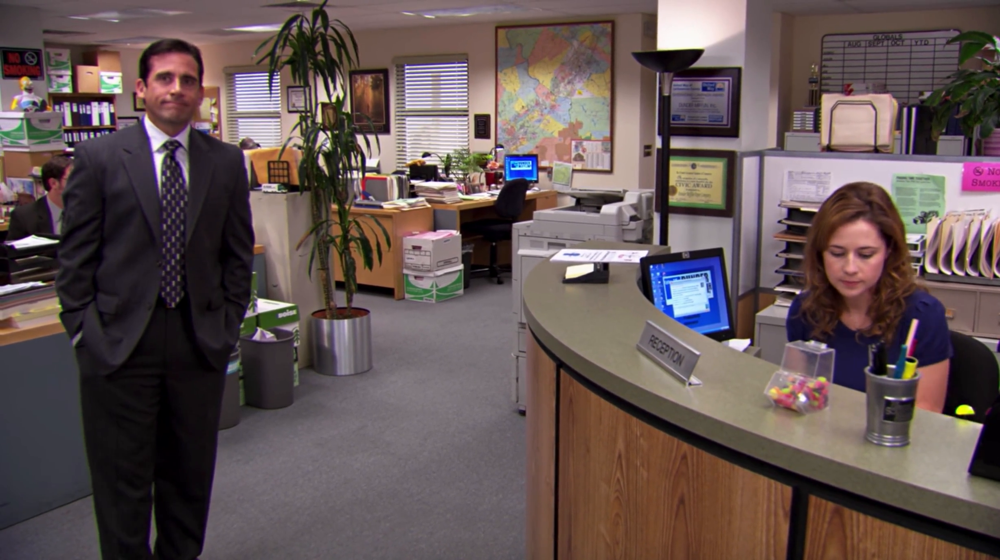
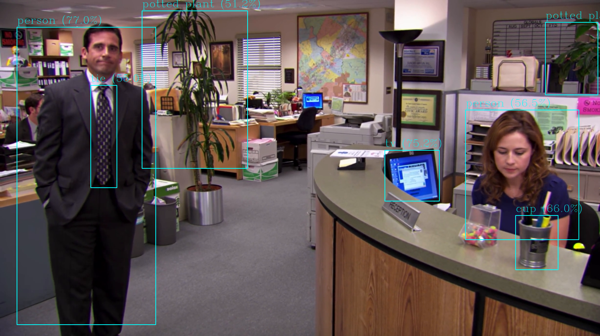
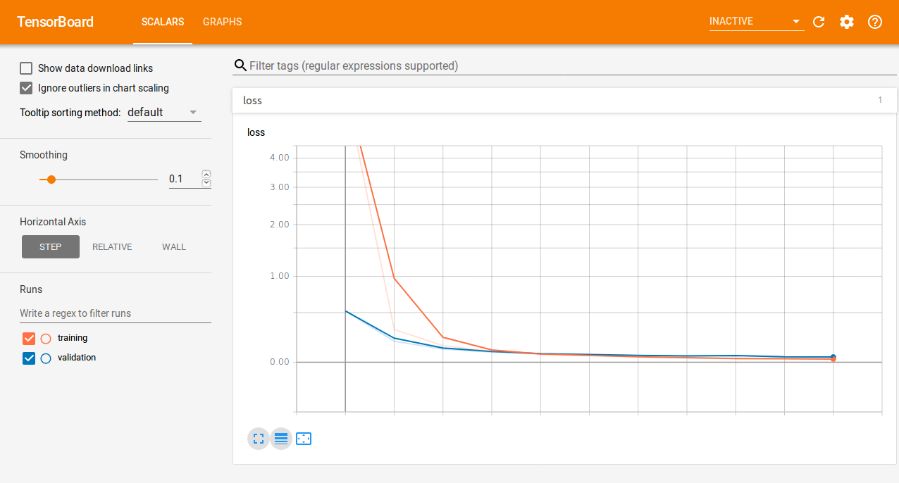

# dourflow: Keras implementation of YOLO v2 

<p align="center">

</p>


**dourflow** is a keras/tensorflow implementation of the state-of-the-art object detection system [You only look once](https://pjreddie.com/darknet/yolo/). 

Original paper and github: [YOLO9000: Better, Faster, Stronger](https://arxiv.org/abs/1612.08242) & [Darknet](https://github.com/pjreddie/darknet).
 

### Dependancies
---
- [keras](https://github.com/fchollet/keras)
- [tensorflow](https://www.tensorflow.org/)
- [numpy](http://www.numpy.org/)
- [h5py](http://www.h5py.org/)
- [opencv](https://pypi.org/project/opencv-python/)
- [python3.5](https://www.python.org/)

### Simple use
---
1. Download pretrained [model](https://drive.google.com/open?id=1khOgS8VD-paUD8KhjOLOzEXkzaXNAAMq) and place it in **dourflow/**.
2. Predict on an [image](https://images.pexels.com/photos/349758/hummingbird-bird-birds-349758.jpeg?auto=compress&cs=tinysrgb&h=350):

```bash
python3 dourflow.py bird.jpg
```
3. Use on webcam (press 'q' to quit):
```bash
python3 dourflow.py cam
```

### Usage
---
Running `python3 dourflow.py --help`:

```bash
usage: dourflow.py [-h] [-m MODEL] [-c CONF] [-t THRESHOLD] [-w WEIGHT_FILE]
                   action

dourflow: a keras YOLO V2 implementation.

positional arguments:
  action                what to do: 'train', 'validate', 'cam' or pass a video, image
                        file/dir.

optional arguments:
  -h, --help            show this help message and exit
  -m MODEL, --model MODEL
                        path to input yolo v2 keras model
  -c CONF, --conf CONF  path to configuration file
  -t THRESHOLD, --threshold THRESHOLD
                        detection threshold
  -w WEIGHT_FILE, --weight_file WEIGHT_FILE
                        path to weight file


```
#### *action* [positional]
Pass what to do with dourflow:

1. A path to an image file/dir or video: Run inference on those file(s).
2. 'cam': Run inference on webcam ('cams' to store the output).
3. 'validate': Perform validation on a trained model.
4. 'train': Perform training on your own dataset.

#### *model* [-m]
Pass the keras input model h5 file (could be to perform inference, validate against or for transfer learning). 

Pretrained COCO/VOC keras models can be downloaded [here](https://drive.google.com/open?id=1bc_kyb_wpOedHAXruj_TN5uIr7D4D_mc). Alternatively, you can download the weights from [here](https://pjreddie.com/darknet/yolov2/) and generate the model file using [YAD2K](https://github.com/allanzelener/YAD2K).
  

#### *conf* [-c]
Pass a config.json file that looks like this (minus the comments!):

```
{
    "model" : {
        "input_size":       416, #Net input w,h size in pixels
        "grid_size":        13, #Grid size
        "true_box_buffer":  10, #Maximum number of objects detected per image
        "iou_threshold":    0.5, #Intersection over union detection threshold
        "nms_threshold":    0.3 #Non max suppression threhsold
    },
    "config_path" : {
        "labels":           "models/coco/labels_coco.txt", #Path to labels file
        "anchors":          "models/coco/anchors_coco.txt", #Path to anchors file
        "arch_plotname":    "" #Model output name (leave empty for none, see result_plots/yolo_arch.png for an example)
    },
    "train": {
        "out_model_name":   "", #Trained model name (saved during checkpoints)
        "image_folder":     "", #Training data, image directory
        "annot_folder":     "", #Training data, annotations directory (use VOC format)
        "batch_size":       16, #Training batch size
        "learning_rate":    1e-4, #Training learning rate
        "num_epochs":       20, #Number of epochs to train for
        "object_scale":     5.0 , #Loss function constant parameter
        "no_object_scale":  1.0, #Loss function constant parameter
        "coord_scale":      1.0, #Loss function constant parameter
        "class_scale":      1.0, #Loss function constant parameter
        "verbose":          1 #Training verbosity
    },
    "valid": {
        "image_folder":     "", #Validation data, image directory
        "annot_folder":     "", #Validation data, annotation directory
        "pred_folder":      "", #Validation data, predicted images directory (leave empty for no predicted image output)
    }
}
``` 
#### *threshold* [-t]

Pass the confidence threshold used for detection (default is 30%).


### Inference
---
##### Single Image/Video
Will generate a file in the same directory with an '_pred' name extension. Example:
```bash
python3 dourflow.py theoffice.png -m coco_model.h5 -c coco_config.json -t 0.35
```
<p align="center">


</p>

##### Batch Images
Will create a directory named **out/** in the current one and output all the images with the same name.

Example:
```bash
python3 dourflow.py images/ -m coco_model.h5 -c coco_config.json -t 0.35
```
<p align="center">

</p>


### Validation
---
Allows to evaluate the performance of a model by computing its [mean Average Precision](http://host.robots.ox.ac.uk:8080/pascal/VOC/voc2012/htmldoc/devkit_doc.html#SECTION00050000000000000000) in the task of object detection (mAP WRITE UP COMING SOON).

Example:

```bash
python3 dourflow.py validate -m voc_model.h5 -c voc_config.json
```
Output:

```bash
Batch Processed: 100%|████████████████████████████████████████████| 4282/4282 [01:53<00:00, 37.84it/s]
AP( bus ): 0.806
AP( tvmonitor ): 0.716
AP( motorbike ): 0.666
AP( dog ): 0.811
AP( horse ): 0.574
AP( boat ): 0.618
AP( sofa ): 0.625
AP( sheep ): 0.718
AP( bicycle ): 0.557
AP( cow ): 0.725
AP( pottedplant ): 0.565
AP( train ): 0.907
AP( bird ): 0.813
AP( person ): 0.665
AP( car ): 0.580
AP( cat ): 0.908
AP( bottle ): 0.429
AP( diningtable ): 0.593
AP( chair ): 0.475
AP( aeroplane ): 0.724
-------------------------------
mAP: 0.674

```


### Training
---

##### Split dataset
Script to generate training/testing splits.

`python3 split_dataset.py -p 0.75 --in_ann VOC2012/Annotations/ --in_img VOC2012/JPEGImages/ --output ~/Documents/DATA/VOC`


##### Anchor Generation

Running:

`python3 dourflow.py genp -c config.json`

Will store your the bounding box priors wherever the path indicates in the config file under **config['config_path']['anchors']** with the prefix 'custom_' (so as to not overwrite accidentally).

##### Tensorboard

Training will create directory **logs/** which will store metrics and checkpoints for all the different training runs.
 
Model passed is used for [transfer learning](https://en.wikipedia.org/wiki/Transfer_learning) (TRAINING FROM SCRATCH / TRAINING ONLY LAST LAYER SHOULD BE ADDED SOON).

Example:
`python3 dourflow.py train -m models/logo/coco_model.h5 -c confs/config_custom.json`

Then, in another terminal tab you can run `tensorboard --logdir=logs/run_X` and open a browser page at `http://localhost:6006/` to monitor the loss, mAP, recall:

<p align="center">

</p>


#### To Do

- [ ] cfg parser
- [x] Anchor generation for custom datasets
- [ ] mAP write up
- [x] Add webcam support
- [ ] Data Augmentation
- [x] TensorBoard metrics

#### Inspired from

- [Darknet](https://github.com/pjreddie/darknet)
- [Darkflow](https://github.com/thtrieu/darkflow)
- [keras-yolo2](https://github.com/experiencor/keras-yolo2)
- [YAD2K](https://github.com/allanzelener/YAD2K)